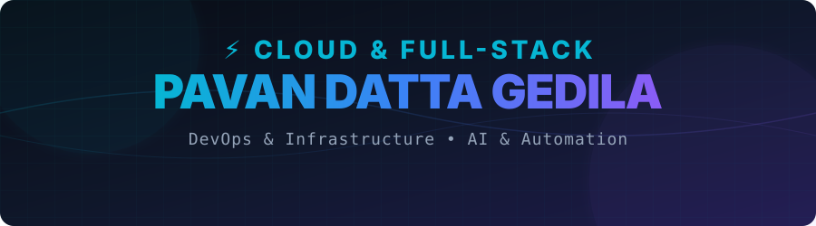

# <p align="center"></p>

<h1 align="center">⚡ Pavan Datta Gedila</h1>
<p align="center">
  <strong>Cloud & Full-Stack Developer | DevOps & Infrastructure Engineer</strong>
</p>

<p align="center">
  
</p>

<p align="center">
  <a href="https://pavangitu.github.io/Pavangitu/" target="_blank">
    
  </a>
</p>

<!-- Animated Profile Desktop Pet Widget -->
<p align="center">
  
</p>

<p align="center">
  
  
  
</p>

<p align="center">
  <a href="https://linkedin.com/in/pavan-datta-gedila-7a1089369" target="_blank"></a>
  <a href="mailto:pavandattagedila@gmail.com"></a>
  <a href="https://github.com/Pavangitu" target="_blank"></a>
  <a href="https://leetcode.com/pavangitu" target="_blank"></a>
</p>

---

## 🔮 About Me

<table width="100%">
  <tr>
    <td width="55%" valign="top">
      <h3>🚀 Engineering Mindset</h3>
      <p>I am a passionate <strong>Computer Science Engineering</strong> student specializing in cloud technology, containerized deployments, and high-performance server-side architectures.</p>
      <p>My focus lies in building scalable, secure, and automated systems using cloud services (AWS/Azure) and modern DevOps practices. I enjoy bridging the gap between code and infrastructure to create robust end-to-end applications.</p>
      <ul>
        <li>🎓 <strong>Education:</strong> B.Tech in CSE at Centurion University of Technology and Management, Odisha (2023 - 2027) — <strong>CGPA: 8.3/10</strong></li>
        <li>📍 <strong>Location:</strong> Hyderabad / Odisha, India</li>
        <li>🔭 <strong>Currently Working On:</strong> <a href="https://github.com/Pavangitu/CareerWith">AI Resume Builder (ATS Optimized)</a></li>
        <li>🌱 <strong>Currently Learning:</strong> Android Applications with Firebase, AWS Cloud Infrastructure & Advanced DevOps Pipelines</li>
        <li>👯 <strong>Looking to Collaborate On:</strong> <a href="https://github.com/Pavangitu/LuffyDesktopPet">Desktop Pet for Windows</a></li>
        <li>🤝 <strong>Looking for Help With:</strong> AWS Cloud Projects & Infrastructure Orchestration</li>
        <li>📫 <strong>How to Reach Me:</strong> <a href="mailto:pavandattagedila@gmail.com">pavandattagedila@gmail.com</a></li>
      </ul>
    </td>
    <td width="45%" valign="top">
      <h3>⚡ Core Competencies</h3>
      <ul>
        <li>☁️ <strong>Cloud Platforms:</strong> AWS (EC2, RDS, S3, IAM, VPC), Azure Fundamentals</li>
        <li>⚙️ <strong>Backend & Systems:</strong> Node.js, Express, PySide6, Python, Windows API</li>
        <li>🛠️ <strong>DevOps & Tools:</strong> Docker, Containerization, Git, GitHub Actions, AWS CLI</li>
        <li>🌐 <strong>Web Development:</strong> React 19, TypeScript, JavaScript, HTML5, CSS3, Tailwind CSS v4</li>
        <li>🗄️ <strong>Databases:</strong> MySQL, PostgreSQL, MongoDB, Firebase</li>
      </ul>
    </td>
  </tr>
</table>

---

## 💼 Featured Projects

<table width="100%">
  <!-- Project 1 -->
  <tr>
    <td width="100%" colspan="2">
      <h3>🌐 AWS Dockerized Node.js Services</h3>
      <p><em>Automated Cloud Deployment Pipeline</em></p>
    </td>
  </tr>
  <tr>
    <td width="50%" valign="top">
      <strong>📋 Overview & Tech Stack</strong><br/>
      Deployed a fully containerized Node.js application hosted on AWS EC2 integrated with AWS RDS (MySQL).
      <br/>
      <code>AWS EC2</code> <code>RDS (MySQL)</code> <code>Docker</code> <code>VPC</code> <code>IAM Roles</code> <code>Git</code>
    </td>
    <td width="50%" valign="top">
      <strong>🛠️ Challenges & Features</strong>
      <ul>
        <li>Configured dedicated multi-subnet VPC with public/private division.</li>
        <li>Implemented strict security groups and IAM roles to restrict database access.</li>
        <li>Eliminated local database dependency using production-grade RDS engines.</li>
      </ul>
    </td>
  </tr>

  <!-- Project 2 -->
  <tr>
    <td width="100%" colspan="2"><hr/><h3>🤖 CareerWith: AI Resume Builder (ATS Optimized)</h3><p><em>AI-Driven Semantic Resume Engine</em></p></td>
  </tr>
  <tr>
    <td width="50%" valign="top">
      <strong>📋 Overview & Tech Stack</strong><br/>
      An auto-scaling single-page resume engine utilizing Gemini AI to suggest tailormade content based on roles.
      <br/>
      <code>React 19</code> <code>TypeScript</code> <code>Express</code> <code>Tailwind CSS v4</code> <code>Gemini AI API</code>
    </td>
    <td width="50%" valign="top">
      <strong>🛠️ Challenges & Features</strong>
      <ul>
        <li>Engineered parser-friendly PDF outputs optimized for Applicant Tracking Systems (ATS).</li>
        <li>Built an asset staging pipeline that automatically discovers and syncs local documents.</li>
        <li>Integrated Gemini AI suggestions using prompt engineering and structured schema outputs.</li>
      </ul>
    </td>
  </tr>

  <!-- Project 3 -->
  <tr>
    <td width="100%" colspan="2"><hr/><h3>👾 Gear 5 Luffy: Desktop Pet Widget</h3><p><em>Interactive OS Widget with PyQt</em></p></td>
  </tr>
  <tr>
    <td width="50%" valign="top">
      <strong>📋 Overview & Tech Stack</strong><br/>
      An interactive, animated desktop pet that roams around the user's screen with physics and collision detection.
      <br/>
      <code>Python</code> <code>PySide6 (Qt)</code> <code>Windows API</code> <code>Pillow</code>
    </td>
    <td width="50%" valign="top">
      <strong>🛠️ Challenges & Features</strong>
      <ul>
        <li>Implemented a custom collision detection system to handle desktop boundary hits.</li>
        <li>Designed a transparent frameless window widget running on a background processing thread.</li>
        <li>Configured low-overhead rendering cycles for minimal CPU and RAM usage.</li>
      </ul>
    </td>
  </tr>

  <!-- Project 4 -->
  <tr>
    <td width="100%" colspan="2"><hr/><h3>📄 OCR Automated Document Conversion System</h3><p><em>AI Document Processing Pipeline</em></p></td>
  </tr>
  <tr>
    <td width="50%" valign="top">
      <strong>📋 Overview & Tech Stack</strong><br/>
      An automated tool that scans and extracts structured text data from images and PDFs.
      <br/>
      <code>Python</code> <code>Tesseract OCR</code> <code>Pillow</code> <code>Regex Engine</code>
    </td>
    <td width="50%" valign="top">
      <strong>🛠️ Challenges & Features</strong>
      <ul>
        <li>Reduced manual data entry time by <strong>70%</strong> using script automation.</li>
        <li>Integrated adaptive thresholding filters to improve OCR reading accuracy.</li>
        <li>Structured unstructured image data into parsed JSON outputs.</li>
      </ul>
    </td>
  </tr>
</table>

---

## ⚡ Engineering Stack & Tools

<table align="center" width="100%">
  <tr>
    <td align="center" width="20%">
      <strong>💻 Languages</strong><br/><br/>
      <br/>
      <br/>
      <br/>
      <br/>
      <br/>
      <br/>
      <br/>
      
    </td>
    <td align="center" width="20%">
      <strong>🎨 Frontend</strong><br/><br/>
      <br/>
      <br/>
      <br/>
      <br/>
      <br/>
      <br/>
      <br/>
      <br/>
      <br/>
      
    </td>
    <td align="center" width="20%">
      <strong>⚙️ Backend & OS</strong><br/><br/>
      <br/>
      <br/>
      <br/>
      <br/>
      <br/>
      <br/>
      
    </td>
    <td align="center" width="20%">
      <strong>☁️ Cloud & DevOps</strong><br/><br/>
      <br/>
      <br/>
      <br/>
      <br/>
      <br/>
      <br/>
      <br/>
      
    </td>
    <td align="center" width="20%">
      <strong>🗄️ Databases</strong><br/><br/>
      <br/>
      <br/>
      <br/>
      <br/>
      
    </td>
  </tr>
</table>

---

## 🏗️ Professional Experience

```text
 📈 Samriddhi Anveshana | Summer Intern (May 2026 - Present)
 └── Hyderabad, India | Focus on cloud architecture and service orchestration.

 ⚙️ Micro Information Technology Services | Cloud Computing Intern (2024 - Present)
 └── Gained deep experience in cloud deployment models (IaaS, PaaS, SaaS).
 └── Configured cloud assets on AWS and Azure under standard security frameworks.
```

---

## 🏆 Certifications & Achievements

*   🏅 **Introduction to Responsible AI** — Google
*   🏅 **Introduction to Generative AI Studio** — Google
*   🏅 **Machine Learning Basics** — AWS
*   🏅 **Master Data Management for Beginners** — TCS
*   🏅 **Mastering Network Security: Defending Against Cyber Threats** — Cert
*   🏅 **AI for Students: Build Your Own Generative AI Model** — Cert
*   🏅 **EY Technology Risk Job Simulation** — EY
*   🏅 **Learn AutoCAD 2D & 3D: From Zero to Hero** — Udemy
*   🚀 **AWS Cloud Practitioner Essentials** — (In Progress)
*   🏆 **College Events:** Actively participated and won prizes in technical hackathons and cloud deployment workshops.

---

## 🌱 Currently Exploring

<table width="100%">
  <tr>
    <td width="33%" align="center">
      🤖<br/><strong>AI Agents & RAG</strong><br/>
      Building multi-agent LLM systems with retrieval augmented generation.
    </td>
    <td width="33%" align="center">
      📦<br/><strong>Cloud-Native Kubernetes</strong><br/>
      Orchestrating container workloads with K8s and Service Meshes.
    </td>
    <td width="34%" align="center">
      🛡️<br/><strong>Security Engineering</strong><br/>
      Configuring secure VPC infrastructures and Identity/Access management.
    </td>
  </tr>
</table>

---

## 📈 GitHub Metrics & Analytics

<div align="center">
  <table border="0">
    <tr>
      <td width="50%"></td>
      <td width="50%"></td>
    </tr>
    <tr>
      <td width="50%"></td>
      <td width="50%"></td>
    </tr>
  </table>
</div>

---

<div align="center">
  <h3>🏆 Trophies</h3>
  <a href="https://github.com/ryo-ma/github-profile-trophy">
    
  </a>
</div>

---

## 🤝 Let's Connect

<div align="center">
  <table border="0" cellpadding="8" cellspacing="0" style="border-collapse: collapse; max-width: 600px; width: 100%;">
    <tr style="border-bottom: 1px solid #30363d;">
      <td align="left"><strong>📬 Email</strong></td>
      <td align="left"><a href="mailto:pavandattagedila@gmail.com">pavandattagedila@gmail.com</a></td>
    </tr>
    <tr style="border-bottom: 1px solid #30363d;">
      <td align="left"><strong>💼 LinkedIn</strong></td>
      <td align="left"><a href="https://linkedin.com/in/pavan-datta-gedila-7a1089369" target="_blank">Pavan Datta Gedila</a></td>
    </tr>
    <tr style="border-bottom: 1px solid #30363d;">
      <td align="left"><strong>💻 GitHub</strong></td>
      <td align="left"><a href="https://github.com/Pavangitu" target="_blank">pavangitu</a></td>
    </tr>
    <tr style="border-bottom: 1px solid #30363d;">
      <td align="left"><strong>📸 Instagram</strong></td>
      <td align="left"><a href="https://www.instagram.com/she__call_me_single?igsh=mwl4mddpbwnqmxzlyg==" target="_blank">she__call_me_single</a></td>
    </tr>
    <tr style="border-bottom: 1px solid #30363d;">
      <td align="left"><strong>🏆 Topcoder</strong></td>
      <td align="left"><a href="https://www.topcoder.com/members/761211" target="_blank">761211</a></td>
    </tr>
    <tr>
      <td align="left"><strong>🐦 Twitter / X</strong></td>
      <td align="left"><a href="https://twitter.com/" target="_blank">Profile</a></td>
    </tr>
  </table>
</div>

<p align="center">
  <em>"Simplicity is the soul of efficiency; automation is the execution of it."</em>
</p>

<p align="center">
  
</p>
